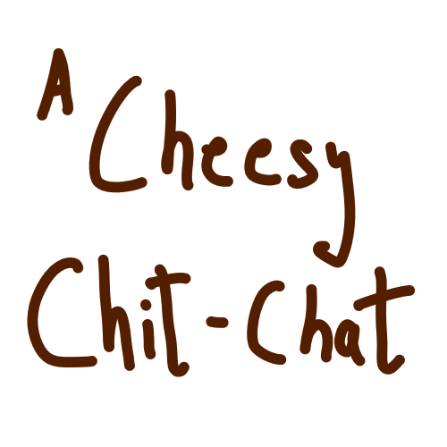
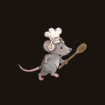

<div align="center">

<a name="top"></a>


&nbsp;&nbsp;

&nbsp;&nbsp;


# 🧀 A CHEESY CHIT-CHAT 🐭

### *Two mice. One recipe. No shared screen.*

**[🇬🇧 English](#-english--the-tale) · [🇮🇹 Italiano](#-italiano--la-storia)**

<br/>


<br/>

<!-- ANIM · sostituisci questa riga con:    -->


<sub>▲ `MouseRun` · 14 frame · 480×480 · il ciclo di corsa disegnato a mano</sub>

<br/><br/>


*🕯️ Le candele sono accese. Il pentolone fuma. Il tempo scorre. 🕯️*

</div>

---

## 📑 Indice · Table of Contents

<table>
<tr>
<td valign="top" width="50%">

**🇬🇧 English**
- [The Tale](#-english--the-tale)
- [Chit & Chat](#-chit--chat)
- [The Five Sacred Steps](#-the-five-sacred-steps)
- [The Four Vials](#-the-four-vials--and-one-trap)
- [The Quality Meter](#-the-quality-meter--aka-the-mold)
- [How to Play](#-how-to-play)

</td>
<td valign="top" width="50%">

**🇮🇹 Italiano · 🛠 Tech**
- [La Storia](#-italiano--la-storia)
- [I Cinque Passi Sacri](#-i-cinque-passi-sacri)
- [Under the Crust](#-under-the-crust--sotto-la-crosta)
- [Mappa del codice](#-mappa-del-codice)
- [Build & Run](#️-build--run)
- [Credits](#-asset-credits)

</td>
</tr>
</table>

<div align="right"><sub><a href="#top">▲ torna su</a></sub></div>

---

<div align="center">

> *"Keep Talking and Nobody Explodes had a child with Venba.*
> *The child was a mouse. The child stole a cheese recipe."*

</div>

---

## 🇬🇧 English — The Tale


Humans locked the recipe away. **Chit** and **Chat**, two mouse siblings,
broke into the old cheesery to steal it back — and free mousekind from
the cheese monopoly forever.

The Rat Queen gave them one warning: *the recipe was split in two.*

**And so are you.**

One of you sees a cheesery and cannot read.
One of you reads a book and cannot touch.
Between you there is only your voice — and a wheel of cheese
slowly, quietly, going bad.

<br clear="right"/>

### 🐭 Chit & Chat

<table>
<tr>
<td align="center" width="50%">
<br/>
<b>CHIT — The Cheesemaker</b><br/>
<sub><i>Player 1 · Unity 2.5D</i></sub>
<br/><br/>
Turns the knob. Drops the vials.<br/>
Slams the press. Drags the wheel to the cellar.<br/>
<br/>
<b>❌ Cannot read a word of the manual.</b>
</td>
<td align="center" width="50%">
<br/>
<b>CHAT — The Reader</b><br/>
<sub><i>Player 2 · HTML manual</i></sub>
<br/><br/>
Holds the ancient book. Ciphers, poems,<br/>
fairy tales, pages to rub clean with a sponge.<br/>
<br/>
<b>❌ Cannot touch a thing in the cheesery.</b>
</td>
</tr>
</table>

<div align="right"><sub><a href="#top">▲ torna su</a></sub></div>

---

### 🧀 The Five Sacred Steps

<div align="center">


</div>

| # | Step | Chit does | Chat knows | ⚠️ The catch |
|:-:|---|---|---|---|
| 🐄 **I** | **Choose the Milk** | Describes four beasts | Deduction rules | Four cows. Almost identical. *Almost.* |
| 🌡️ **II** | **Heat the Milk** | Turns the 3D knob | Target state matrix | Match **bubbles / steam / foam** — never the number |
| 🧪 **III** | **Curdle It** | Drops four vials | A poem in riddle | One order only. Guess, and the milk dies. |
| 🔩 **IV** | **Press the Wheel** | `drain → press → flip → press → flip` | The true sequence | 5 lights · one mistake resets **all of them** |
| 🏺 **V** | **Age It** | Places the wheel on a shelf | A fairy tale of heat & damp | Three shelves. Only one keeps it alive. |

<div align="right"><sub><a href="#top">▲ torna su</a></sub></div>

---

### 🧪 The Four Vials — *and one trap*

<div align="center">


</div>

| Vial | What it truly does | The poem calls it… |
|---|---|---|
| 🦠 **Starter Culture** | Wakes the bacteria, sours the milk | *"the sleepers that must wake first"* |
| 💧 **Rennet** | Splits curd from whey | *"the knife that cuts without a blade"* |
| 🧂 **Salt** | Draws out water, guards from rot | *"the thirsty crystal"* |
| 🟠 **Annatto** | Dyes the paste gold — *pure vanity* | *"the sunset the wheel wears"* |
| 🌿 **Herbs** | **The trap.** Never in the true recipe. | *"the green temptation"* |

<div align="right"><sub><a href="#top">▲ torna su</a></sub></div>

---

### 🦠 The Quality Meter — a.k.a. *the mold*

<table>
<tr>
<td width="55%" valign="middle">

There is no health bar. There is **quality**, and it only goes down.

| | State | Meaning |
|:-:|---|---|
| 🟢 | **Fresh** | Clean wheel. Divine ending still possible. |
| 🟡 | **Veined** | The mold found a crack. Chat is reading too slowly. |
| 🔴 | **Spoiled** | Edible only by regret. |

Every wrong knob, every wrong vial, every reset of the press —
the mold sprite creeps a little further across the wheel.

> **You never fail instantly.**
> **You fail beautifully, over five levels.**

</td>
<td width="45%" align="center" valign="middle">
<br/>

</td>
</tr>
</table>

<div align="right"><sub><a href="#top">▲ torna su</a></sub></div>

---

### 🎮 How to Play

```
1.  Launch the build  ·  press START
2.  Player 2 opens the HTML manual   ← do NOT let Player 1 see it
3.  Player 1 takes the mouse and the cheesery
4.  TALK. Describe. Argue. Panic. Re-describe.
5.  Reach the cellar with green quality  →  🏆 the Divine Wheel
```

> 💡 **Best played on two screens side by side** — or across a table, the way mice intended.

<div align="right"><sub><a href="#top">▲ torna su</a></sub></div>

---

## 🇮🇹 Italiano — La Storia


Gli umani hanno chiuso la ricetta sotto chiave. **Chit** e **Chat**, due topi
fratelli, si intrufolano nella vecchia casearia per rubarla — e liberare per
sempre la loro specie dal monopolio del formaggio.

Ma la ricetta è divisa in due. E anche voi.

<br clear="right"/>

|  | Ruolo | Vede | Non può |
|:-:|---|---|---|
| 🧑‍🍳 | **Chit — Il Casaro** *(P1)* | La casearia 2.5D: pentolone, fiale, pressa, cantina | Leggere il manuale |
| 📖 | **Chat — Il Lettore** *(P2)* | Il manuale HTML: cifrari, poemi, fiabe, pagine da grattare | Toccare nulla |

**L'unica interfaccia tra voi è la voce.**

### 🧀 I Cinque Passi Sacri

| # | Passo | Il tranello |
|:-:|---|---|
| 🐄 **I** | **Scegli il Latte** | Quattro mucche quasi identiche. *Quasi.* |
| 🌡️ **II** | **Scalda il Latte** | Si abbina lo **stato** del liquido (bolle, vapore, schiuma), mai il numero |
| 🧪 **III** | **Caglia** | Quattro fiale, un solo ordine. Il poema lo sa, voi no. |
| 🔩 **IV** | **Pressa** | `drain → press → flip → press → flip` · un errore azzera tutte e 5 le lucine |
| 🏺 **V** | **Stagiona** | Tre mensole, una fiaba, tolleranze nascoste di umidità e calore |

### 🧪 Le Fiale

**Starter Culture** sveglia i batteri · **Rennet** separa la cagliata ·
**Salt** toglie acqua e protegge · **Annatto** colora d'oro *(pura vanità)* ·
🌿 **Herbs** *non è mai stata nella ricetta vera.*

### 🦠 La Quality Bar

Non c'è vita: c'è **qualità**, e scende soltanto. Ogni errore fa avanzare lo
sprite della **muffa** sulla forma. Non si perde mai di colpo: si fallisce
lentamente, con stile, per cinque livelli.

<div align="right"><sub><a href="#top">▲ torna su</a></sub></div>

---

## 🛠 Under the Crust · Sotto la Crosta

<details open>
<summary><b>🎨 Il trucco 2.5D — come un disegno diventa fisica</b></summary>

<br/>

Ogni disegno a mano è uno **Sprite 2D immerso in uno spazio 3D**:
`Billboard.cs` lo tiene sempre in faccia alla camera, mentre `Rigidbody` e
`Collider` sono veri. Le fiale **cadono** davvero, la forma **rotola** davvero.

> *Sembra un libro illustrato. Si comporta come una cucina.*

</details>

<details>
<summary><b>📁 Mappa del codice</b></summary>

<br/>

```
Assets/Scripts/
│
├── 🧠 Core_Managers/
│     GameManager · GameConfig · MenuManager
│     PauseMenuManager · EndingManager · VolumeSettings
│
├── 🧀 Levels_Stations/
│     Level1Manager ............ deduzione mucche
│     Level3Manager ............ sequenza fiale
│     Level4Manager ............ drain / press / flip
│     Level5Manager ............ mensole di stagionatura
│     RotateKnobMouseButtons ... manopola del pentolone
│
├── 🖐 Interactions_3D/
│     Interactor · Clickable3D · PhysicsGrabber
│     DraggableIngredient · IngredientDropZone · IngredientID
│     DraggableCheese · ShelfSlot · CheeseTag · CowRef
│
├── 🎥 Audio_Visuals/
│     CameraDirector (Cinemachine) · Billboard · GameFeel
│     IdleBreath · MouseParallax · PostFX
│     BackgroundManager · StationActivator · SimpleCellularTransition
│
└── 🖼 UI_Interface/
      QualityBar · HoverUI · ButtonFeedback · FakeLoadingScreen
```

</details>

<details>
<summary><b>⚙️ Sistemi principali</b></summary>

<br/>

| Sistema | Dove | Cosa fa |
|---|---|---|
| 🎥 **Regia** | `CameraDirector.cs` | Cinemachine: stacchi e push-in su ogni stazione |
| 🎚️ **Audio** | `MainMixer.mixer` · `ProceduralMusicManager.cs` | Ducking sugli impatti, pitch randomizzato, musica generata |
| 🔥 **Atmosfera** | `PostFX.cs` · `GameFeel.cs` · `IdleBreath.cs` | Luci di fuoco, screen-shake, sprite che "respirano" |
| 🌀 **Transizioni** | `Easy Transition` · `SimpleCellularTransition.cs` | Dissolvenze cellulari fra i livelli |
| 📖 **Manuale** | `Assets/StreamingAssets/manual` · `ChitRecipe.pdf` | Canvas/JS puro: crittografia, fisica CSS, audio Web API (spugna su tela) |
| 🐭 **Animazioni** | `MouseRun.anim` · `CowIdle.controller` · `LoadingIcon.anim` | Topi che corrono, mucche che ruminano, caricamenti che girano |

</details>

<details>
<summary><b>🐭 Rigenerare la GIF del topo dallo sprite sheet</b></summary>

<br/>

`LoadingIcon.png` è una griglia **5×3** di celle **480×480**;
`MouseRun.anim` usa i **primi 14 frame** a ~8.5 fps in loop.

```bash
mkdir -p docs && python3 - <<'EOF'
from PIL import Image
sheet = Image.open("Assets/Drawings/New Assets/LoadingIcon.png").convert("RGBA")
W = H = 480
frames = [sheet.crop(((i%5)*W, (i//5)*H, (i%5)*W+W, (i//5)*H+H)).resize((160,160), Image.LANCZOS)
          for i in range(14)]
out = [Image.alpha_composite(Image.new("RGBA",(160,160),(26,20,16,255)), f)
       .convert("P", palette=Image.ADAPTIVE) for f in frames]
out[0].save("docs/mouse-run.gif", save_all=True, append_images=out[1:],
            duration=117, loop=0, optimize=True)
EOF
```

Poi sostituisci il commento `<!-- ANIM -->` in cima con:
``

</details>

### ▶️ Build & Run

```bash
git clone https://github.com/tommasomilleri/GameDesign.git
```

| Requisito | Valore |
|---|---|
| Engine | **Unity 6** · Universal Render Pipeline |
| Scena principale | `Assets/Scenes/Cheesery3D.unity` |
| Manuale P2 | `Assets/StreamingAssets/manual` |
| Piattaforma | Windows / macOS standalone |

<div align="right"><sub><a href="#top">▲ torna su</a></sub></div>

---

## 🎨 Asset Credits

> Tutta l'arte 2D disegnata a mano, il design, la scrittura e il codice di gioco:
> **Tommaso Milleri** 🐭

| Pack | Autore |
|---|---|
| [KayKit Dungeon Pack](https://kaylousberg.itch.io/kaykit-dungeon-pack) | Kay Lousberg |
| [Lowpoly Animated Animals](https://quaternius.itch.io/lowpoly-animated-animals) | Quaternius |
| [Dungeon Props Low Poly](https://imersastudios.itch.io/dungeon-props-low-poly-pack) | Imersa Studios |
| [Medieval Slavic Tavern](https://goryana.itch.io/medieval-slavic-tavern-game-assets) | Goryana |
| [2D/3D Halloween Assets](https://goryana.itch.io/2d-and-3d-halloween-game-assets) | Goryana |
| Casual Game Sounds · Free UI Click SFX Pack | *(vedi `Assets/Sounds`)* |

---

<div align="center">


*"Proprietà della Grand Fromagerie.*
*Che gli umani non lo trovino mai."*

<br/>

**🐭 squeak responsibly 🧀**

<sub><a href="#top">▲ back to top</a></sub>

</div>