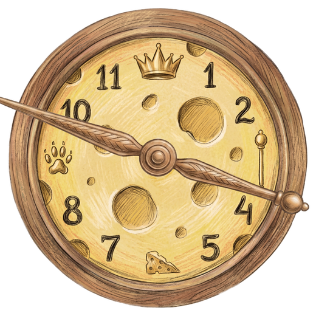
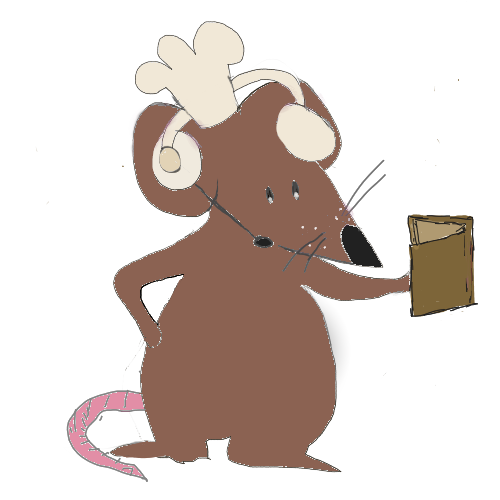
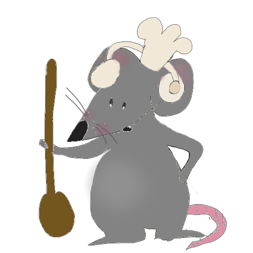
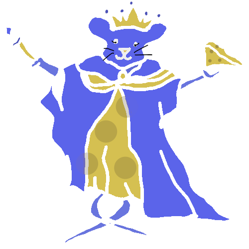
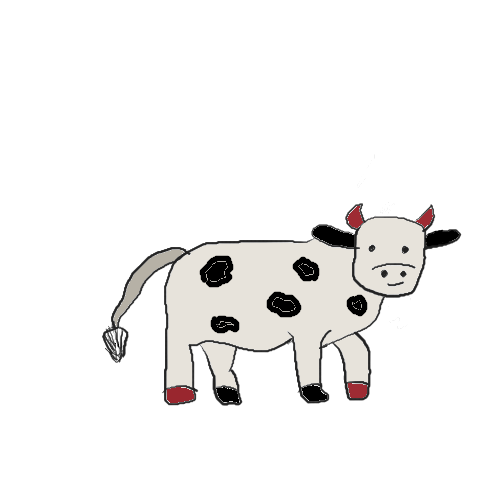
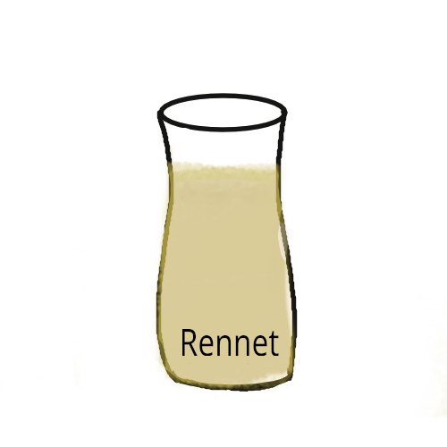
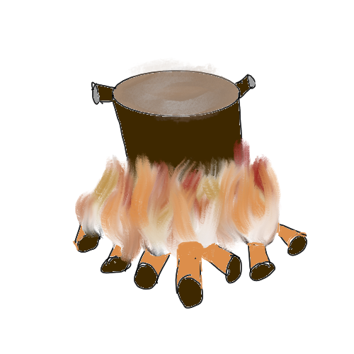
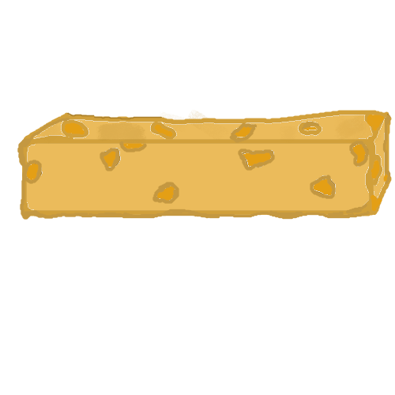

<div align="center">

<a name="top"></a>


# 🧀 A CHEESY CHIT-CHAT 🐭

### *Two mice. One recipe. No shared screen.*

<br/>

[](README.md)
[](README.it.md)

<br/>


<br/>


<sub>▲ <code>MouseRun.anim</code> · 14 frames · 480×480 · hand-drawn run cycle</sub>

<br/><br/>



*🕯️ The candles are lit. The pot is steaming. Time is running. 🕯️*

</div>

---

<div align="center">

> *"Keep Talking and Nobody Explodes had a child with Venba.*
> *The child was a mouse. The child stole a cheese recipe."*

</div>

Humans locked the recipe away. **Chit** and **Chat**, two mouse siblings,
broke into the old cheesery to steal it back — and free mousekind from the
cheese monopoly forever.

The recipe was split in two. **And so are you.**

One of you sees a cheesery and cannot read.
One of you reads a book and cannot touch.
Between you there is only your voice — and a wheel of cheese
slowly, quietly, going bad.

<div align="right"><sub><a href="#top">▲ back to top</a></sub></div>

---

## 📑 Table of Contents

|   | Section |   | Section |
| :-: | --- | :-: | --- |
| 🪪 | [The ID Cards](#-the-id-cards) | 🎨 | [From Pencil to Pixel](#-from-pencil-to-pixel) |
| 👑 | [The Rat Queen](#-the-rat-queen) | 💻 | [The Code](#-the-code--three-mechanics) |
| 🦠 | [The Quality Bar](#-the-quality-bar--the-mold-creeps-in) | 🔊 | [Jukebox](#-jukebox) |
| 🧪 | [Style & Ingredients](#-style--ingredients) | ▶️ | [Build & Run](#️-build--run) |

---

## 🎮 How to Play

```
1.  Launch the build  ·  press START
2.  Player 2 opens the manual    ← do NOT let Player 1 see it
3.  Player 1 takes the mouse and the cheesery
4.  TALK. Describe. Argue. Panic. Re-describe.
5.  Reach the cellar with green quality  →  🏆 the Divine Wheel
```

> 💡 **Best played on two screens side by side** — or across a table, the way mice intended.

<div align="right"><sub><a href="#top">▲ back to top</a></sub></div>

---

## 🪪 The ID Cards

<table>
<tr>

<td align="center" width="50%">


### 🧑‍🍳 CHIT

**THE CHEESEMAKER**

|   |   |
| --- | --- |
| 🎮 **Player** | 1 |
| 🖥 **Interface** | Unity · 2.5D cheesery |
| ✋ **Can** | turn, pour, press, drag |
| 🚫 **Cannot** | read *a single word* of the manual |
| 🗣 **Catchphrase** | *"It's the one with the crooked spot!"* |
| 🧠 **Superpower** | fast hands |
| 💀 **Weakness** | describes badly under pressure |

<sub>Impulsive. Touches before asking.<br/>Has already spilled the rennet twice.</sub>

</td>

<td align="center" width="50%">


### 📖 CHAT

**THE READER**

|   |   |
| --- | --- |
| 🎮 **Player** | 2 |
| 🖥 **Interface** | illustrated manual · outside Unity |
| ✋ **Can** | decipher, translate, interpret |
| 🚫 **Cannot** | touch *anything* in the cheesery |
| 🗣 **Catchphrase** | *"Wait. WAIT. Not yet."* |
| 🧠 **Superpower** | encyclopedic patience |
| 💀 **Weakness** | reads far too slowly |

<sub>Methodical. Asks before touching.<br/>Has never touched anything in their life.</sub>

</td>

</tr>
</table>

<div align="center">

**⚡ The only interface between them is your voice. ⚡**

</div>

<div align="right"><sub><a href="#top">▲ back to top</a></sub></div>

---

## 👑 The Rat Queen


She does not play. **She judges.**

She appears at the start to hand you the mission, and at the end to weigh
what you have done. No hints, no second chances: she simply looks at the
wheel you offer her and decides whether the Grand Fromagerie welcomes you
or forgets you.

> *"Property of the Grand Fromagerie.*
> *May the humans never find it."*

Her verdict depends on **one variable only**: the quality that survived
five levels. No timer, no hidden score — only the mold you let grow.

<br clear="right"/>

<div align="right"><sub><a href="#top">▲ back to top</a></sub></div>

---

## 🦠 The Quality Bar — *the mold creeps in*

<table>
<tr>
<td width="42%" align="center" valign="middle">


**▲ the wheel**


**▲ the mold**

</td>
<td width="58%" valign="middle">

There is no health bar. There is **quality**, and it only goes down.

`Muffa.png` is an `Image` in **Filled mode**: every mistake raises its
`fillAmount`, and the green eats the cheese from the outside in.

|   | Threshold | What happens |
| :-: | --- | --- |
| 🟢 | `> 80%` | Clean wheel · neutral tint · divine ending still possible |
| 🟡 | `40–80%` | Green veins · the colour shifts · Chat is reading too slowly |
| 🔴 | `< 40%` | **The mold pulses** · oscillating alpha · edible only by regret |

> **You never fail instantly.**
> **You fail beautifully, over five levels.**

</td>
</tr>
</table>

<details>
<summary><b>💻 How the mold breathes — <code>QualityBar.cs</code></b></summary>

<br/>

Below 40% the mold stops being static and **breathes**: a sine on unscaled
time modulates the alpha, so the effect keeps running even while paused.

```csharp
private void UpdateMoldVisual(float currentQuality, bool instant)
{
    float healthPercent = currentQuality / maxQuality;
    moldFillImage.fillAmount = 1f - healthPercent;   // the mold grows

    if (healthPercent < 0.4f)
    {
        // Aggressive mold + alpha pulse (it breathes!)
        float pulse = 0.8f + Mathf.Sin(Time.unscaledTime * 5f) * 0.2f;
        moldFillImage.color = new Color(0.55f, 0.85f, 0.4f, pulse);
    }
    else if (healthPercent < 0.8f)
        moldFillImage.color = new Color(0.7f, 0.9f, 0.55f, 1f);
    else
        moldFillImage.color = Color.white;
}
```

And when the bar takes damage it **wobbles** — 0.3s, scale 1 → 1.06 → 1:

```csharp
float scale = 1f + Mathf.Sin((elapsed / duration) * Mathf.PI) * 0.06f;
transform.localScale = originalScale * scale;
```

</details>

<div align="right"><sub><a href="#top">▲ back to top</a></sub></div>

---

## 🧪 Style & Ingredients

The world is made of hand-drawn objects, each with a precise role in the
recipe — or in leading you astray.

<div align="center">


&nbsp;&nbsp;

&nbsp;&nbsp;

&nbsp;&nbsp;

&nbsp;&nbsp;


</div>

| Asset | Role | The poem calls it… |
| --- | --- | --- |
| 💧 **Rennet** | Splits curd from whey | *"the knife that cuts without a blade"* |
| 🌿 **Herbs** | **The trap.** Never in the true recipe. | *"the green temptation"* |
| 🕯️ **Candle** | The cellar's only dynamic light source | *"the eye that never sleeps"* |
| ⚙️ **Gear** | The beast you rebuild: it tells you how many presses | *"the count that turns"* |
| 🐄 **Cow** | Four of them. Only one gives the right milk. | *"the four that look alike"* |

<div align="right"><sub><a href="#top">▲ back to top</a></sub></div>

---

## 🎨 From Pencil to Pixel

Everything you see was born **on paper**, by hand. No asset generated from
nothing: the linework, the proportions, the personality all started as a drawing.

### ① First pass — hand-drawn sketches

The first assets were direct scans: dirty lines, flat colours, low resolution.
Good enough for the prototype, but in a lit 3D scene you could see the paper.

<div align="center">







<sub>▲ <code>Assets/Drawings/</code> — first generation, raw scans</sub>

</div>

### ② Second pass — refined with Gemini

Each sketch was fed to **Gemini** as a visual reference, asking it to clean up
line and volume **while preserving the original stroke**: same pose, same
silhouette, same expression — but high resolution, clean alpha, and shading
consistent with candlelight.

<div align="center">


<sub>▲ <code>Assets/Drawings/New Assets/</code> — second generation, refined</sub>

</div>

<table>
<tr>
<th width="50%">Before · <code>Drawings/</code></th>
<th width="50%">After · <code>New Assets/</code></th>
</tr>
<tr>
<td align="center"></td>
<td align="center"></td>
</tr>
<tr>
<td align="center"></td>
<td align="center"></td>
</tr>
</table>

> **There was one rule:** the AI never *invented* a subject.
> It only refined what the pencil had already decided.
> Design, pose, palette and writing remain entirely human.

<div align="right"><sub><a href="#top">▲ back to top</a></sub></div>

---

## 💻 The Code — three mechanics

<details open>
<summary><b>🖼 The 2.5D trick — a drawing that stands up in 3D</b></summary>

<br/>

Every sprite is a cardboard standee planted in 3D space. `Billboard.cs`
rotates it in `LateUpdate` to always face the camera, but **on the Y axis only**:
so it stays upright like a cut-out and never "lies down" when the camera drops.

```csharp
void LateUpdate()
{
    if (cam == null) cam = Camera.main;
    if (cam == null) return;

    if (yAxisOnly)
    {
        Vector3 dir = transform.position - cam.transform.position;
        dir.y = 0f;                                   // stays upright
        if (dir.sqrMagnitude > 0.001f)
            transform.rotation = Quaternion.LookRotation(dir);
    }
    else
    {
        transform.rotation = cam.transform.rotation;  // full billboard
    }
}
```

</details>

<details>
<summary><b>🧪 The vial sequence — and the physical bounce of failure</b></summary>

<br/>

The correct order is just an array of strings. But the good part is the error:
the pot doesn't show a popup — it **spits the vial out** with an upward impulse
plus a random component, so every failure flies off in a different direction.

```csharp
[SerializeField] private string[] correctOrder =
    { "Starter Culture", "Rennet", "Salt", "Annatto" };

public void CheckIngredient(IngredientID ingredient, Rigidbody rb)
{
    if (ingredient.ingredientName == correctOrder[currentStep])
    {
        currentStep++;
        UpdatePotVisuals();                 // the pot changes colour
        ingredient.gameObject.SetActive(false);
        if (currentStep == correctOrder.Length) LevelComplete();
    }
    else
    {
        GameManager.instance.DecreaseGlobalQuality(wrongAnswerPenalty);

        // Physical bounce: the pot throws it back into the air!
        rb.linearVelocity = Vector3.zero;
        rb.AddForce(Vector3.up * 8f + Random.onUnitSphere * 2f, ForceMode.Impulse);
    }
}
```

</details>

<details>
<summary><b>🎨 The pot that changes colour with every ingredient</b></summary>

<br/>

Five sprites (`PotEmpty` → `PotCream` → `PotPink` → `PotLightBrown` → `PotBrown`)
indexed directly on the current step. Chit **sees** the progress without any
text telling them — and can describe it to Chat.

```csharp
void UpdatePotVisuals()
{
    int spriteIndex = Mathf.Min(currentStep, potSprites.Length - 1);

    if (potSpriteRenderer != null) potSpriteRenderer.sprite = potSprites[spriteIndex];
    if (potImageComponent != null) potImageComponent.sprite = potSprites[spriteIndex];
}
```

<div align="center">
 →
 →
 →
 →

</div>

</details>

<details>
<summary><b>🗂 Full script map</b></summary>

<br/>

```
Assets/Scripts/
├── Core_Managers/       GameManager · GameConfig · MenuManager
│                        PauseMenuManager · EndingManager · VolumeSettings
├── Levels_Stations/     Level1Manager  → cow deduction
│                        Level3Manager  → vial sequence
│                        Level4Manager  → drain / press / flip
│                        Level5Manager  → aging shelves
│                        RotateKnobMouseButtons → pot knob
├── Interactions_3D/     Interactor · Clickable3D · PhysicsGrabber
│                        DraggableIngredient · IngredientDropZone · IngredientID
│                        DraggableCheese · ShelfSlot · CheeseTag · CowRef
├── Audio_Visuals/       CameraDirector · Billboard · GameFeel · IdleBreath
│                        MouseParallax · PostFX · BackgroundManager
│                        StationActivator · SimpleCellularTransition
├── UI_Interface/        QualityBar · HoverUI · ButtonFeedback · FakeLoadingScreen
├── LevelSetup.cs        Level bootstrap
├── PotTrigger.cs        Pot physics trigger
└── ProceduralMusicManager.cs
```

</details>

<div align="right"><sub><a href="#top">▲ back to top</a></sub></div>

---

## 🔊 Jukebox

GitHub doesn't embed audio in a README, but **clicking a file plays it**
in the viewer. Listen to the cheesery:

|   | Sound | Where it lives in the game |
| :-: | --- | --- |
| 🎹 | [`cozy-and-warm-relaxing-piano.mp3`](Assets/Sounds/cozy-and-warm-relaxing-piano.mp3) | The background theme · cozy, slow, deceptive |
| 🔥 | [`fire-crackling.mp3`](Assets/Sounds/fire-crackling.mp3) | Under the pot, looping in 3D space |
| 🫧 | [`boiling-water.mp3`](Assets/Sounds/boiling-water.mp3) | Level II · when the knob goes too far up |
| 💧 | [`simmering-water.mp3`](Assets/Sounds/simmering-water.mp3) | Level II · the correct state |
| 🕐 | [`clock-ticking.mp3`](Assets/Sounds/clock-ticking.mp3) | The pressure that never leaves you |
| 🎛 | [`Knob.wav`](Assets/Sounds/Knob.wav) | Every click of the knob, pitch-randomised |
| ✅ | [`correct.mp3`](Assets/Sounds/correct.mp3) | Relief |
| ❌ | [`wrong.mp3`](Assets/Sounds/wrong.mp3) | Mold |

> 🎚️ Everything routes through [`MainMixer.mixer`](Assets/Sounds/MainMixer.mixer):
> **ducking** on impacts (the music lowers itself) and **randomised pitch** on
> repeated sounds, so your ears don't go numb after the twentieth knob turn.

<div align="right"><sub><a href="#top">▲ back to top</a></sub></div>

---

## ▶️ Build & Run

```bash
git clone https://github.com/tommasomilleri/GameDesign.git
```

| Requirement | Value |
| --- | --- |
| 🎮 Engine | **Unity 6** · Universal Render Pipeline |
| 🎬 Main scene | [`Assets/Scenes/Cheesery3D.unity`](Assets/Scenes/Cheesery3D.unity) |
| 🧪 Test scene | [`Assets/Scenes/Puzzle1.unity`](Assets/Scenes/Puzzle1.unity) |
| 📖 Player 2 manual | [`ChitRecipe.pdf`](ChitRecipe.pdf) |
| 💻 Platform | Windows · macOS standalone |

<details>
<summary><b>🐭 Regenerating the mouse GIF from the sprite sheet</b></summary>

<br/>

`LoadingIcon.png` is a **5×3** grid of **480×480** cells;
`MouseRun.anim` uses the **first 14 frames** at roughly 8.5 fps, looping.

Save this as `make_gif.py` in the project root and run `python make_gif.py`:

```python
from PIL import Image
import os

os.makedirs("docs", exist_ok=True)

sheet = Image.open("Assets/Drawings/New Assets/LoadingIcon.png").convert("RGBA")
W = H = 480
SIZE = 200
BG = (0, 0, 0, 255)

frames = [
    sheet.crop(((i % 5) * W, (i // 5) * H, (i % 5) * W + W, (i // 5) * H + H))
         .resize((SIZE, SIZE), Image.LANCZOS)
    for i in range(14)
]

out = [
    Image.alpha_composite(Image.new("RGBA", (SIZE, SIZE), BG), f)
         .convert("P", palette=Image.ADAPTIVE)
    for f in frames
]

out[0].save("docs/mouse-run.gif", save_all=True, append_images=out[1:],
            duration=117, loop=0, optimize=True)

print("ok -> docs/mouse-run.gif")
```

</details>

<details>
<summary><b>🕐 Regenerating the clock with its hand</b></summary>

<br/>

Save as `make_clock.py` and run `python make_clock.py`.
Tweak `0.42` for the hand size and `-38` for the angle in degrees.

```python
from PIL import Image
import os

os.makedirs("docs", exist_ok=True)

c = Image.open("Assets/Drawings/New Assets/Clock.png").convert("RGBA")
h = Image.open("Assets/Drawings/New Assets/ClockHand2.png").convert("RGBA")

new_w = int(c.width * 0.42)
h = h.resize((new_w, int(h.height * new_w / h.width)), Image.LANCZOS)
h = h.rotate(-38, expand=True, resample=Image.BICUBIC)

c.alpha_composite(h, ((c.width - h.width) // 2, (c.height - h.height) // 2))
c.resize((520, int(520 * c.height / c.width)), Image.LANCZOS).save("docs/clock.png")

print("ok -> docs/clock.png")
```

</details>

<div align="right"><sub><a href="#top">▲ back to top</a></sub></div>

---

## 🎨 Credits

> Hand-drawn 2D art, design, writing and game code:
> **Tommaso Milleri** 🐭
> *Sprite refinement assisted by Gemini, based on original drawings.*

| Pack | Author |
| --- | --- |
| [KayKit Dungeon Pack](https://kaylousberg.itch.io/kaykit-dungeon-pack) | Kay Lousberg |
| [Lowpoly Animated Animals](https://quaternius.itch.io/lowpoly-animated-animals) | Quaternius |
| [Dungeon Props Low Poly](https://imersastudios.itch.io/dungeon-props-low-poly-pack) | Imersa Studios |
| [Medieval Slavic Tavern](https://goryana.itch.io/medieval-slavic-tavern-game-assets) | Goryana |
| [2D/3D Halloween Assets](https://goryana.itch.io/2d-and-3d-halloween-game-assets) | Goryana |
| Casual Game Sounds · Free UI Click SFX Pack | *(see `Assets/Sounds`)* |
| [Easy Transition](Assets/Easy%20Transition/Readme.md) | *(see folder)* |

---

<div align="center">


**🐭 squeak responsibly 🧀**

<sub><a href="#top">▲ back to top</a> · <a href="README.it.md">🇮🇹 Leggi in italiano</a></sub>

</div>